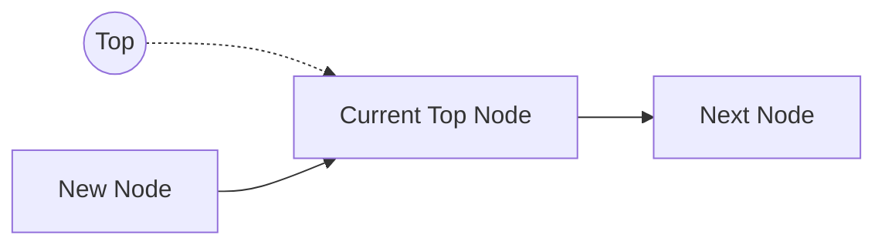
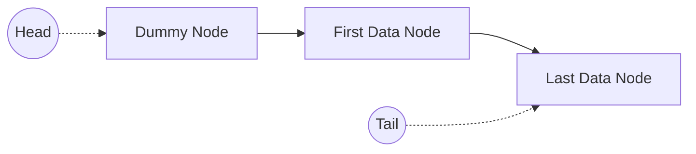

# Lock-Free Containers

`LockFree` 디렉터리는 CAS 기반 Stack과 Queue를 포함합니다.

자료구조의 Top, Head, Tail을 `InterlockedCompareExchange64()`로 갱신하며, Node는 `TlsMemoryPool`을 통해 할당하고 반환합니다.

## 주요 구성

| 자료구조 | 역할 |
|---|---|
| `LFStack` | LIFO 방식의 Lock-Free Stack |
| `LFQueue` | Dummy Node 기반의 Lock-Free Queue |
| `MAXLFQueue` | Enqueue 전에 최대 크기를 확인하는 Lock-Free Queue |

## LFStack

`LFStack<DATA>`는 하나의 Top Pointer를 사용하는 LIFO 자료구조입니다.

### Push

`Push()`는 `TlsMemoryPool`에서 새로운 Node를 할당하고 기존 Top을 새 Node의 Next로 지정합니다.

이후 새 Node의 주소와 Tag를 결합한 값을 `InterlockedCompareExchange64()`로 Top에 반영합니다. 다른 Thread가 먼저 Top을 변경했다면 갱신된 Top을 기준으로 다시 시도합니다.



원형은 Pointer, 사각형은 Node를 나타냅니다. 점선은 Pointer의 참조를, 실선은 Node의 Next 연결을 의미합니다.

### Pop

`Pop()`은 현재 Top의 실제 주소를 구한 뒤 다음 Node를 새로운 Top으로 교체합니다.

Top 교체에 성공하면 기존 Node의 데이터를 반환하고, 사용이 끝난 Node는 `TlsMemoryPool`로 반환합니다. Stack이 비어 있으면 `false`를 반환합니다.

## LFQueue

`LFQueue<DATA>`는 Head와 Tail Pointer 및 Dummy Node를 사용하는 FIFO 자료구조입니다.



Head는 항상 Dummy Node를 가리킵니다. 실제 데이터는 Head 다음 Node부터 저장됩니다.

### Enqueue

`Enqueue()`는 다음 과정으로 Node를 추가합니다.

1. `TlsMemoryPool`에서 새로운 Node를 할당합니다.
2. Tail을 새 Node로 교체합니다.
3. 기존 Tail의 Next에 새 Node를 연결합니다.
4. Queue 크기를 증가시킵니다.

초기에는 기존 Tail의 Next에 새 Node를 연결한 뒤 Tail을 갱신했습니다. 그러나 어떤 Thread가 Tail Node를 `oldTail`로 저장한 사이 Queue의 Enqueue와 Dequeue가 진행되면, 해당 Node는 더 이상 실제 Tail이 아니게 될 수 있습니다.

이 Node가 메모리 풀로 반환된 뒤 다시 할당되면 Next가 `nullptr`로 초기화됩니다. 과거의 `oldTail`을 보관하고 있던 Thread는 이를 연결 가능한 Tail로 판단하여 실제 Tail이 아닌 Node의 Next에 새 Node를 연결할 수 있습니다. 이후 Tail 갱신 CAS는 실패하지만 Next 연결은 이미 완료된 상태이므로, 같은 Thread에서 요청한 Enqueue 순서가 역전될 수 있습니다.

이를 해결하기 위해 Next를 변경하기 전에 Tail 갱신 CAS를 먼저 수행하도록 순서를 변경했습니다. 현재 Queue의 Tail과 `oldTail`이 일치할 때만 CAS에 성공하므로, 실제 Tail임을 확인한 Thread만 해당 Node의 Next를 변경할 수 있습니다.

공용 메모리 풀을 통해 과거의 Tail Node가 다른 Queue에서 재사용되면, 원래 Queue에 추가하려던 Node가 다른 Queue에 연결될 가능성도 있었습니다.

이 문제에 대해서는 Node 주소와 Queue ID를 `Interlocked128`로 함께 비교하는 방법도 검토했습니다. 현재 방식은 Tail 갱신 CAS를 먼저 수행하여 다른 Queue에 재사용된 Node의 Next를 변경하지 않으면서, `Interlocked128`에 따른 추가 동기화 비용도 피할 수 있어 그대로 적용했습니다.

### Dequeue

`Dequeue()`는 Head 다음에 연결된 Node의 데이터를 읽고, 해당 Node를 새로운 Head로 교체합니다.

기존 Dummy Node는 `TlsMemoryPool`로 반환되고, 데이터를 가지고 있던 Node가 다음 Dequeue를 위한 새로운 Dummy Node 역할을 합니다. Queue가 비어 있으면 `false`를 반환합니다.

## MAXLFQueue

`MAXLFQueue<DATA>`는 `LFQueue`와 같은 Queue 구조에 최대 크기 확인을 추가한 자료구조입니다.

```cpp
MAXLFQueue(unsigned long maxsize = 50000);
```

`Enqueue()` 호출 시 현재 크기가 설정한 `_maxSize` 이상이면 Node를 추가하지 않고 `false`를 반환합니다.

현재 `ContentsServer`의 Session별 Send Queue에서 `SBuffer` 전송 대기 목록을 관리하는 데 사용됩니다.

## Tagged Pointer

Stack과 Queue는 Pointer의 하위 48bit에 Node 주소를 저장하고, 상위 16bit를 Tag로 사용합니다.

```text
63                         48 47                              0
+----------------------------+--------------------------------+
|          Tag 16bit         |          Address 48bit         |
+----------------------------+--------------------------------+
```

Node가 추가될 때 Tag를 증가시키고 주소와 결합합니다. CAS에서 주소와 Tag를 함께 비교하여 동일한 주소가 다시 사용되는 상황을 구분하고, 주소 재사용으로 인한 ABA 문제의 발생 가능성을 낮춥니다.

## Node 메모리 관리

각 자료구조의 Node는 `TlsMemoryPool`을 통해 관리합니다.

- Node 추가 시 `Alloc()`으로 확보
- Node 제거 후 `Free()`로 반환
- Thread별 여유 Node 우선 사용
- 필요할 때 공용 Chunk 목록 사용

이를 통해 Stack과 Queue 연산에서 반복적으로 발생하는 Node의 동적 할당과 해제를 줄였습니다.

## 사용 위치

| 자료구조 | 사용 위치 |
|---|---|
| `LFStack<int>` | `ContentsServer`의 Session Index 관리 |
| `LFQueue<Control*>` | `FighterServer`의 Control 요청 Queue |
| `MAXLFQueue<SBuffer*>` | Session별 Send Queue |

## 사용 시 주의사항

Container를 소멸하기 전에 다른 Thread의 접근이 모두 종료되어야 합니다.

복사와 이동 생성 및 대입은 금지되어 있습니다.

## Related Documentation

- [Common](../README.md)
- [TLS](../TLS/README.md)
- [Project Overview](../../README.md)
