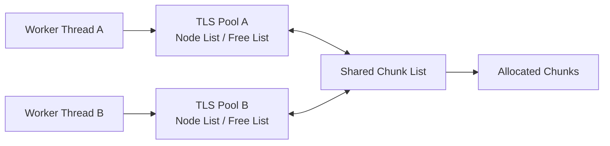

# TLS

`TLS` 디렉터리는 TLS 기반 객체 메모리 풀과 MySQL·Redis Connector를 포함합니다.

`TlsMemoryPool`은 Thread별 여유 노드를 활용해 공용 자원 접근을 줄이며, 현재 Battle Session Server에서는 객체와 Lock-Free Container의 Node 재사용에 사용됩니다.

## 주요 구성

| 구성 요소 | 역할 |
|---|---|
| `TlsMemoryPool` | Thread별 여유 노드와 공용 Chunk를 사용하는 객체 메모리 풀 |
| `DBConnector` | 단일 MySQL 연결과 Query 결과 및 오류 상태를 관리하는 Connector |
| `TLSDBConnector` | Thread별 MySQL 연결과 조회 결과를 TLS에 보관하는 Connector |
| `TLSRedisConnector` | Thread별 Redis 접속 기능을 제공하는 Connector |

## TlsMemoryPool

`TlsMemoryPool<DATA>`는 객체를 Chunk 단위로 확보하고, 각 Thread가 자신의 여유 노드 목록을 사용하도록 구성한 메모리 풀입니다.



### Thread별 Pool

각 Thread가 `TlsMemoryPool`에 처음 접근하면 `TlsPool`을 생성하고 `TlsSetValue()`를 통해 등록합니다.

Thread별 `TlsPool`은 다음 목록을 관리합니다.

| 목록 | 역할 |
|---|---|
| `_nodelist` | 객체 할당에 우선적으로 사용하는 여유 노드 목록 |
| `_freelist` | `_nodelist`가 가득 찬 이후 반환된 노드를 보관하는 목록 |

각 목록에는 현재 보관 중인 노드 수가 함께 기록됩니다.

### 할당

`Alloc()`은 다음 순서로 객체를 확보합니다.

1. 현재 Thread의 `_nodelist`에서 노드를 가져옵니다.
2. `_nodelist`가 비어 있으면 `_freelist`에서 가져옵니다.
3. 두 목록이 모두 비어 있으면 공용 Chunk 목록에서 Chunk를 가져옵니다.
4. 공용 목록도 비어 있으면 새로운 Chunk를 할당합니다.

새로운 Chunk는 생성자에서 지정한 `chunkSize`만큼의 Node를 포함합니다. Chunk를 할당한 Thread는 그중 하나를 즉시 사용하고, 나머지는 자신의 `_nodelist`에 보관합니다.

### 반환

`Free()`로 반환된 객체는 반환을 수행한 Thread의 TLS Pool에 저장됩니다.

우선 `_nodelist`에 보관하고, `_nodelist`가 `chunkSize`만큼 차 있으면 `_freelist`에 저장합니다. `_freelist`에도 `chunkSize`만큼의 노드가 모이면 공용 Chunk 목록으로 반환하여 다른 Thread가 재사용할 수 있도록 합니다.

이 구조를 통해 일반적인 할당과 반환은 Thread별 목록에서 처리하고, 필요한 경우에만 공용 Chunk 목록에 접근합니다.

### Tagged Pointer

공용 Chunk 목록은 주소와 Tag를 하나의 64bit 값으로 저장합니다.

```text
63                         48 47                              0
+----------------------------+--------------------------------+
|          Tag 16bit         |          Address 48bit         |
+----------------------------+--------------------------------+
```

Chunk를 공용 목록으로 반환할 때 `InterlockedIncrement16()`으로 Tag를 증가시키고, 주소와 결합한 64bit 값을 생성합니다.

공용 Chunk 목록의 갱신은 `InterlockedCompareExchange64()`를 이용해 수행합니다. 주소와 함께 Tag를 비교하여 동일한 주소가 다시 사용된 경우를 구분할 수 있도록 구성했습니다.

### 객체 생성과 소멸

생성자의 `PlacementNew` 옵션을 활성화하면 `Alloc()`에서 객체의 생성자를 호출하고 `Free()`에서 소멸자를 호출합니다. 기본값은 `false`입니다.

```cpp
TlsMemoryPool(int chunkSize = 500, bool PlacementNew = false);
```

메모리 풀이 확보한 Chunk는 Custom Deleter가 설정된 `unique_ptr` 목록이 소유하며, 메모리 풀이 소멸할 때 함께 해제됩니다.

### 상태 확인

다음 함수를 통해 메모리 풀의 상태를 확인할 수 있습니다.

| 함수 | 반환 값 |
|---|---|
| `GetCapacity()` | 확보한 전체 노드 수 |
| `GetUsingCount()` | 현재 사용 중인 노드 수 |
| `GetChunkCount()` | 공용 목록에 보관된 Chunk 수 |
| `GetStoredNodeCount()` | 현재 Thread가 보관한 노드 수 |

`TlsMemoryPool`은 다음 객체와 자료구조에서 사용됩니다.

- `SBuffer`
- `Player`
- `Control`
- Lock-Free Queue와 Stack의 Node

## MySQL Connector

### DBConnector

`DBConnector`는 하나의 MySQL 연결과 Query 결과 및 오류 상태를 관리합니다.

다음 기능을 제공합니다.

- MySQL 연결과 해제
- 저장 및 조회 Query 실행
- Transaction 시작, Commit, Rollback
- 설정한 기준 시간을 초과한 Query 기록
- Duplicate Key, Deadlock, Lock Timeout 및 연결 오류 분류

현재 Battle Session Server에서는 각 DB Worker가 자신의 `DBConnector`를 생성하여 독립적인 MySQL 연결을 사용합니다.

### TLSDBConnector

`TLSDBConnector`는 Thread별 MySQL 연결과 조회 결과를 TLS에 보관하도록 구현되어 있습니다.

Thread에서 처음 DB 기능을 사용할 때 TLS 데이터를 생성하며, 이후 같은 Thread에서는 해당 Thread에 저장된 MySQL 연결을 사용합니다.

현재 Battle Session Server의 DB Worker에서는 `TLSDBConnector` 대신 `DBConnector`를 사용합니다.

## Redis Connector

`TLSRedisConnector`는 Thread별 TLS 데이터에 Redis 접속 객체와 최근 조회 결과를 보관하도록 구현되어 있습니다.

`cpp_redis`를 이용한 `Set`, `SetEx`, `Get`, `Del` 기능을 제공하지만, 현재 Battle Session Server에서는 사용하지 않습니다.

## Related Documentation

- [Common](../README.md)
- [Project Overview](../../README.md)
- [Lock-Free Containers](../LockFree/README.md)
