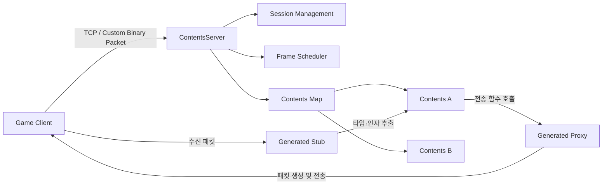
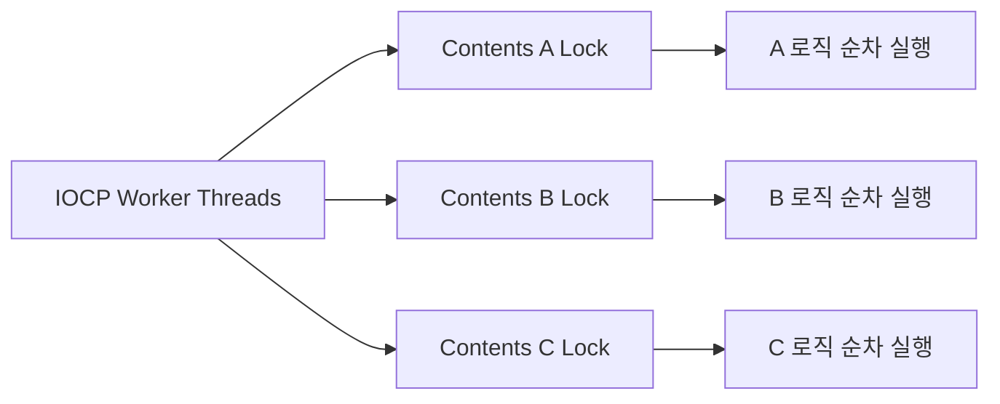
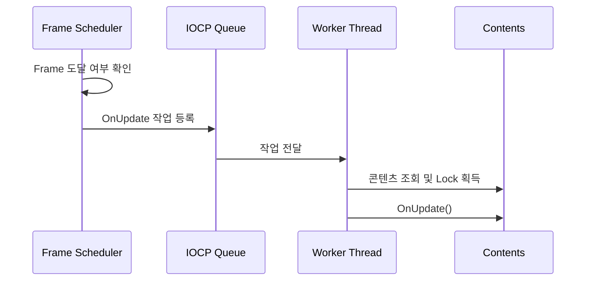
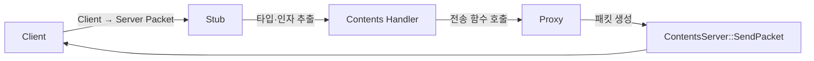
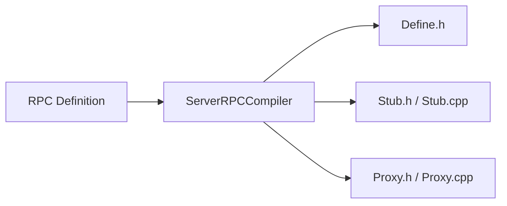

  # ContentLibB

`ContentLibB`는 Windows IOCP 네트워크 처리 위에서 콘텐츠 단위로 로직을 실행하기 위한 라이브러리입니다.

네트워크 이벤트를 `Contents` 객체에 전달하고 동일한 콘텐츠의 로직을 직렬로 실행합니다. 콘텐츠 등록·해제와 세션 이동을 지원하며, 직접 구현한 RPC Compiler를 통해 Stub·Proxy 코드를 생성합니다.

## 전체 구조



## 주요 기능

- Windows IOCP 기반 비동기 네트워크 처리
- 클라이언트 Session 관리
- 콘텐츠 등록 및 해제
- 기본 콘텐츠 지정 및 세션 이동
- 콘텐츠 단위 로직 직렬 실행
- Frame 기반 `OnUpdate()` 실행
- `shared_ptr` 기반 콘텐츠 수명 관리
- Stub·Proxy 기반 패킷 처리
- RPC Definition 기반 통신 코드 생성

## ContentsServer

`ContentsServer`는 네트워크와 콘텐츠 실행 환경을 관리하는 기반 클래스입니다.

주요 역할은 다음과 같습니다.

- Listen Socket과 IOCP 관리
- Accept 및 IOCP Worker Thread 관리
- Session 생성과 해제
- 패킷 수신 및 송신
- 콘텐츠 등록과 해제
- 콘텐츠 이벤트 전달
- Frame Scheduler 관리
- Timeout 및 모니터링 처리

서버 구현체는 `ContentsServer`를 상속하고 연결 및 Session 이벤트를 구현합니다.

| 이벤트 | 호출 시점 |
|---|---|
| `OnConnectionRequest()` | 연결을 수락하기 전 |
| `OnAccept()` | Session 생성 후 |
| `OnRelease()` | Session 연결 종료 시 |
| `OnUnusual()` | Packet Code 불일치 또는 Decode 실패 시 |
| `OnSecond()` | 1초 주기의 서버 모니터링 시 |

## Contents

`Contents`는 게임 로직의 실행 단위를 나타내는 추상 클래스입니다.

| 이벤트 | 역할 |
|---|---|
| `OnEnter()` | Session이 콘텐츠에 입장할 때 호출 |
| `OnLeave()` | Session이 콘텐츠에서 나갈 때 호출 |
| `OnUpdate()` | 설정된 Frame마다 호출 |
| `OnShutDown()` | 콘텐츠 종료 요청 시 호출 |

콘텐츠는 생성할 때 Contents Number와 Update Frame을 설정합니다.

```cpp
Contents(std::int32_t contentsNum, std::int32_t frame);
```

`frame`은 밀리초 단위이며, `-1`로 설정하면 주기적인 `OnUpdate()`를 실행하지 않습니다.

## 콘텐츠 단위 로직 직렬 실행

각 `Contents` 객체는 전용 SRW Lock을 가집니다.

IOCP Worker Thread는 콘텐츠 이벤트를 실행하기 전에 해당 콘텐츠의 Exclusive Lock을 획득합니다.

```text
콘텐츠 조회
→ 콘텐츠별 Exclusive Lock 획득
→ OnEnter / OnLeave / OnUpdate / Stub 실행
→ Lock 해제
```

따라서 동일한 콘텐츠의 로직은 한 번에 하나만 실행됩니다.

서로 다른 콘텐츠는 각각 별도의 Lock을 사용하므로 여러 IOCP Worker Thread에서 병렬로 실행할 수 있습니다.



## 콘텐츠 등록과 수명 관리

`ContentsServer`는 Contents Number를 Key로 사용하는 콘텐츠 맵을 관리합니다.

```cpp
std::unordered_map<std::int32_t, std::shared_ptr<Contents>> _contentsMap;
```

| API | 역할 |
|---|---|
| `RegisterContents()` | 콘텐츠 등록 |
| `DeregisterContents()` | 콘텐츠 등록 해제 |
| `SetDefaultContents()` | 신규 Session의 기본 콘텐츠 지정 |
| `InsertToContents()` | 콘텐츠 입장 이벤트 등록 |
| `DeleteFromContents()` | 콘텐츠 퇴장 이벤트 등록 |
| `TryMoveSessionToContents()` | Session의 현재 콘텐츠 변경 |

Worker Thread는 콘텐츠 맵에서 `shared_ptr<Contents>`를 복사한 뒤 Map Shared Lock을 해제합니다.

```text
Map Shared Lock 획득
→ 콘텐츠 조회 및 shared_ptr 복사
→ Map Shared Lock 해제
→ 콘텐츠별 Lock 획득
→ 콘텐츠 로직 실행
```

다른 Thread가 실행 중인 콘텐츠를 맵에서 제거하더라도 Worker Thread가 보유한 `shared_ptr`가 실행이 끝날 때까지 객체의 수명을 유지합니다.

마지막 참조가 해제된 시점에 객체가 파괴되거나 설정된 Custom Deleter가 실행됩니다.

## Frame Scheduler

Frame Scheduler는 10ms 주기로 콘텐츠 맵을 확인합니다.

각 콘텐츠에 설정된 Frame이 도달하면 Contents Number를 이용해 IOCP에 `OnUpdate()` 작업을 등록합니다. 실제 `OnUpdate()`는 IOCP Worker Thread가 콘텐츠별 Lock을 획득한 뒤 실행합니다.



Frame Scheduler는 콘텐츠 맵을 순회해 실행할 Contents Number를 수집한 뒤 Map Shared Lock을 해제합니다.

## 세션과 콘텐츠 이동

새로 연결된 Session은 `SetDefaultContents()`로 지정한 기본 콘텐츠에 배치됩니다.

Session을 다른 콘텐츠로 이동할 때는 다음 기능을 조합하여 사용합니다.

```text
기존 콘텐츠에서 이동 준비
→ Session의 Contents Number 변경
→ 대상 콘텐츠 OnEnter 작업 등록
```

`TryMoveSessionToContents()`는 Session이 유효하고 연결 종료 중이 아닌 경우에만 Contents Number를 변경합니다.

이동 중간 상태에는 `CONMOV(-1)`을 사용할 수 있습니다.

## RPC 처리 구조

ContentLibB는 Stub과 Proxy를 이용해 패킷 처리 코드를 분리합니다.



### Stub

Stub은 수신 패킷에서 메시지 타입과 인자를 추출한 뒤 해당 처리 함수를 호출합니다.

정의되지 않은 메시지 타입은 콘텐츠별 Default 처리 함수로 전달합니다.

### Proxy

Proxy는 메시지 타입과 인자를 패킷에 기록하고 지정된 Session에 전송합니다.

## RPC Compiler

`ServerRPCCompiler`는 RPC Definition 파일을 읽어 패킷 처리 코드를 생성하는 도구입니다.



### Definition 형식

```text
#Fighter#
<Fight>
{
CS CSMoveStart(unsigned char dir, unsigned short x, unsigned short y); #10
SC SCMoveStart(unsigned int id, unsigned char dir, unsigned short x, unsigned short y); #11
}
```

| 문법 | 의미 |
|---|---|
| `#Fighter#` | 출력 파일과 디렉터리 Prefix |
| `<Fight>` | 생성할 Stub·Proxy 클래스 이름 |
| `CS` | Client → Server 메시지 |
| `SC` | Server → Client 메시지 |
| 함수명 | 생성할 처리 또는 전송 함수 |
| 함수 인자 | 패킷에서 읽거나 기록할 데이터 |
| `#10` | 메시지 타입 ID |

각 함수는 한 줄로 정의하며 메시지 타입 ID가 중복되지 않도록 작성해야 합니다.

### 생성 결과

`#Fighter#` Definition을 입력하면 `RPC_Fighter` 디렉터리에 다음 파일을 생성합니다.

```text
RPC_Fighter/
├── FighterDefine.h
├── FighterStub.h
├── FighterStub.cpp
├── FighterProxy.h
└── FighterProxy.cpp
```

| 파일 | 역할 |
|---|---|
| `FighterDefine.h` | 메시지 타입 ID 정의 |
| `FighterStub.h/.cpp` | 메시지 분기, 인자 추출 및 처리 함수 호출 |
| `FighterProxy.h/.cpp` | 패킷 생성 및 Session 전송 |

### 실행

RPC Compiler 실행 파일에 Definition 파일을 인자로 전달합니다.

```text
ServerRPCCompiler.exe RPCDefinition.txt
```

출력 디렉터리는 실행 시점의 현재 작업 디렉터리를 기준으로 생성됩니다.

## Stub·Proxy 연결

생성된 Stub과 Proxy는 서버 또는 콘텐츠에 연결하여 사용합니다.

```cpp
AttachStub(stub);
AttachProxy(proxy);
```

Stub의 처리 인터페이스를 상속하여 실제 콘텐츠 로직을 구현합니다.

```cpp
class StubForFight : public FightStub
{
public:
    void ProcCSMoveStart(std::int64_t sessionID, unsigned char dir, unsigned short x, unsigned short y) override;
};
```

## 관련 문서

- [MO Session Server](../../README.md)
- [Battle Session Server](../../Servers/BattleSessionServer/README.md)
- [Common](../../Common/README.md)
- [Lock-Free Containers](../../Common/LockFree/README.md)
- [TLS Utilities](../../Common/TLS/README.md)
