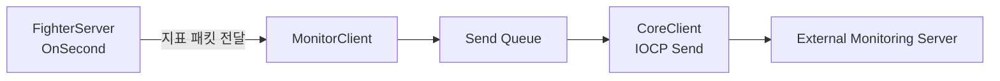

# MonitorClient

`MonitorClient`는 Battle Session Server에서 생성한 상태 및 처리 지표를 외부 모니터링 서버로 전송하는 TCP Client입니다.

이 저장소에는 모니터링 데이터를 수신·저장·표시하는 외부 모니터링 서버가 포함되어 있지 않습니다.

## 주요 구성

| 구성 요소 | 역할 |
|---|---|
| `CoreClient` | IOCP 기반 TCP 연결과 비동기 송수신 처리 |
| `MonitorClient` | 모니터링 서버 로그인 및 지표 패킷 전송 |
| `MonitorProtocol.h` | 로그인, 데이터 전송 및 지표 종류 정의 |

## 전체 흐름



`FighterServer`는 `OnSecond()`에서 서버 상태와 처리 지표를 수집하고 지표별 패킷을 생성합니다.

`MonitorClient`는 지표를 직접 수집하거나 해석하지 않고, 전달받은 패킷을 외부 모니터링 서버로 전송합니다.

## 연결 및 로그인

`MonitorClient`는 `CoreClient`를 상속하며 생성자에서 모니터링 대상 서버 번호를 전달받습니다.

```cpp
MonitorClient(int serverno);
```

모니터링 서버에 연결되면 `OnConnect()`에서 다음 로그인 패킷을 자동으로 전송합니다.

```text
WORD    Message Type
int     Server Number
```

현재 Battle Session Server에서는 Server Number로 `217`을 사용합니다.

## 데이터 패킷

모니터링 데이터 패킷은 다음 값으로 구성됩니다.

```text
WORD    Message Type
BYTE    Data Type
int     Data Value
int     Timestamp
```

| 필드 | 역할 |
|---|---|
| Message Type | 모니터링 데이터 전송 패킷 식별 |
| Data Type | 전송하는 지표 종류 |
| Data Value | 지표 값 |
| Timestamp | 지표를 수집한 시각 |

Battle Session Server가 수집하는 지표는 [Battle Session Server](../Servers/BattleSessionServer/README.md)에서 확인할 수 있습니다.

## IOCP 송수신

`CoreClient`는 IOCP와 `RingBuffer`를 이용해 모니터링 서버와 비동기 송수신을 처리합니다.

`MonitorClient`는 `CoreClient`의 `LANCLIENT` 패킷 형식을 사용하며, Payload 앞에 2-byte 길이 Header를 추가하여 전송합니다. 또한 하나의 송신만 등록되도록 제어합니다.

종료 시 Socket을 닫고 IOCP Worker Thread가 종료될 때까지 대기한 뒤 Winsock을 정리합니다.

## 설정

Battle Session Server는 다음 설정 파일을 이용해 모니터링 서버에 연결합니다.

```text
Servers/BattleSessionServer/MonitorClient_Config.txt
```

```text
CoreClient_Config
{
    IP:127.0.0.1
    Port:20790
    Heartbeat:0
    HeartbeatCycle:10
}
```

- `IP`, `Port`: 외부 모니터링 서버 접속 정보
- `Heartbeat`: `CoreClient`의 Heartbeat Thread 활성화 여부
- `HeartbeatCycle`: Heartbeat 전송 여부를 확인하는 주기

`CoreClient`의 Heartbeat는 일정 시간 동안 송신이 없을 때 Monitor Server로 Heartbeat 패킷을 보내기 위해 마련된 기능입니다. 현재 구현에서는 실제 패킷 전송 부분이 활성화되어 있지 않으며, Battle Session Server의 MonitorClient 설정에서도 `Heartbeat`를 `0`으로 두어 사용하지 않습니다.

외부 모니터링 서버가 실행되지 않은 상태에서는 연결할 수 없으므로, Battle Session Server보다 먼저 실행해야 합니다.

## Related Documentation

- [Project Overview](../README.md)
- [Battle Session Server](../Servers/BattleSessionServer/README.md)
- [Common](../Common/README.md)
