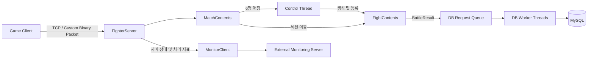

# MO Session Server

Windows IOCP 기반의 **3 vs 3 멀티플레이 전투 세션 서버**입니다.

접속한 플레이어를 6명 단위로 매칭하고, 매치마다 독립적인 전투 콘텐츠를 생성합니다. 전투 결과는 DB Worker Threads를 통해 MySQL에 비동기로 저장하며, 서버 상태와 처리 지표는 별도의 모니터링 서버로 전송합니다.

> 이 저장소는 전체 게임 서버 시스템 중 세션 및 전투 서버를 담당합니다.  
> 정상적인 실행을 위해 별도 프로젝트의 모니터링 서버와 MySQL Server가 필요합니다.

## 주요 기능

- Windows IOCP 기반 비동기 네트워크 처리
- 6인 매칭 및 3 vs 3 팀 편성
- 매치별 `FightContents` 동적 생성 및 회수
- 콘텐츠 단위 요청 직렬화
- 이동·공격 요청 검증 및 전투 상태 브로드캐스트
- DB Worker Threads를 이용한 전투 결과 비동기 저장
- MySQL Transaction, Rollback 및 제한적 재시도
- 서버·콘텐츠·DB 상태 모니터링
- 진행 중인 콘텐츠와 DB 작업을 소진한 뒤 종료하는 단계별 Graceful Shutdown

## 아키텍처



`FighterServer`는 IOCP 기반 네트워크 처리와 콘텐츠 단위 로직의 직렬 실행을 제공하는 `ContentsServer`를 상속합니다.

이를 기반으로 매칭·전투 콘텐츠와 Control Thread, DB Worker Threads 및 `MonitorClient`를 관리합니다.

## 핵심 구현

### 콘텐츠 기반 서버 구조

서버 로직을 역할에 따라 두 종류의 콘텐츠로 분리했습니다.

| 콘텐츠 | 역할 |
|---|---|
| `MatchContents` | 플레이어 대기, 6인 매칭 및 팀 편성 |
| `FightContents` | 캐릭터 생성, 이동, 공격, 피격 및 게임 종료 |

동일한 콘텐츠에 전달된 요청은 순차적으로 처리합니다. 서로 다른 콘텐츠는 여러 IOCP Worker Thread를 통해 병렬로 실행할 수 있도록 구성했습니다.

플레이어 6명의 매칭이 완료되면 Control Thread가 새로운 `FightContents`를 생성하고 콘텐츠 맵에 등록합니다.

매칭된 세션은 생성된 전투 콘텐츠로 이동하며, 게임이 종료된 콘텐츠는 해제되어 Object Pool로 반환됩니다.

### 콘텐츠 생명주기 및 Lock 관리

`FightContents`의 생성과 해제를 Control Thread로 분리하여 콘텐츠 실행 로직과 생명주기 관리를 분리했습니다.

콘텐츠 맵에서는 조회와 `shared_ptr` 복사에 필요한 구간에서만 Shared Lock을 점유합니다. 이후 Map Lock을 해제하고 콘텐츠별 Lock을 획득하여 로직을 실행합니다.

이를 통해 콘텐츠 맵의 Shared Lock 점유 시간을 줄이고, Control Thread의 등록·해제 과정에서 발생하는 Exclusive Lock 대기 시간을 줄이면서도 실행 중인 콘텐츠의 수명을 안전하게 유지하도록 구성했습니다.

### 비동기 DB 저장

전투 결과 저장을 네트워크 처리와 분리하여 전용 DB Worker Threads에서 수행합니다.

전투가 종료되면 저장에 필요한 데이터를 `BattleResult`로 구성하여 DB Request Queue에 등록하고, DB Worker가 이를 가져와 MySQL에 저장합니다.

DB Worker는 다음 데이터를 하나의 Transaction으로 저장합니다.

- 매치 결과
- 참가자별 승패 기록
- 플레이어별 누적 전투 통계

저장 과정에서 오류가 발생하면 Rollback을 수행합니다.

Deadlock과 Lock Timeout은 Rollback에 성공하여 Transaction이 정상적으로 정리되고 안전하게 다시 실행할 수 있는 경우에만 제한적으로 재시도합니다.

이를 통해 일시적인 DB 충돌로 인한 저장 실패를 보완하면서도 무제한 재시도로 DB Queue가 지속적으로 증가하지 않도록 제한했습니다.

### RPC 코드 생성

직접 구현한 RPC Compiler가 프로토콜 정의 파일을 분석하여 RPC ID, Stub 및 Proxy 코드를 생성합니다.

생성된 Stub은 수신 패킷에서 메시지 타입과 인자를 꺼내 해당 처리 함수를 호출합니다.

Proxy는 전송할 메시지 타입과 인자를 패킷에 기록하고 지정된 세션에 전송합니다.

이를 통해 패킷 정의에서 반복되는 송수신 코드를 생성하여 직렬화·역직렬화와 패킷 분기를 공통 처리하도록 구성했습니다.

## 모니터링

`FighterServer`가 수집한 서버 상태와 처리 지표를 `MonitorClient`를 통해 외부 모니터링 서버로 전송합니다.

| 분류 | 모니터링 항목 |
|---|---|
| 네트워크 | 현재 접속자 수, 초당 Accept 수, 초당 송수신 패킷 수 |
| 콘텐츠 | 활성 전투 콘텐츠 수, 초당 생성·회수 수, Fight FPS 평균·최솟값·최댓값 |
| 데이터베이스 | 초당 DB 저장 처리 건수, DB Queue 크기, 저장 성공·실패·재시도 및 오류 유형 |
| 시스템 | CPU, 메모리 및 Object Pool 사용량 |

모니터링 정보를 이용해 서버가 정상적으로 요청을 처리하고 있는지뿐만 아니라 콘텐츠 생성·회수 상태와 DB Queue 적체 여부를 함께 확인할 수 있도록 구성했습니다.

> 모니터링 서버는 별도 프로젝트로 구성되어 있으며 이 저장소에는 포함되어 있지 않습니다.

## 안정성 검증

서버를 장시간 실행한 뒤 Graceful Shutdown을 수행하여 새로운 작업의 유입을 차단하고, 진행 중인 콘텐츠와 DB 작업을 모두 처리한 뒤 서버 자원이 정상적으로 반환되는지 검증했습니다.

### Graceful Shutdown

서버 종료 요청이 발생하면 즉시 모든 Thread를 종료하지 않고 다음 단계에 따라 순차적으로 종료합니다.

1. 새로운 클라이언트 접속을 차단합니다.
2. 대기 중인 플레이어의 연결을 정리합니다.
3. 진행 중인 `FightContents`가 종료될 때까지 기다립니다.
4. DB Queue에 남아 있는 전투 결과를 모두 저장합니다.
5. 새로운 Frame 작업 등록을 중단합니다.
6. IOCP Worker가 이미 등록된 작업을 모두 처리하도록 합니다.
7. Worker, Timeout, Monitor 및 DB 관련 Thread를 종료합니다.
8. 서버에서 관리하던 Object Pool 및 내부 자원을 정리합니다.

종료 도중 진행 중인 전투 결과가 유실되거나 사용 중인 콘텐츠가 강제로 반환되지 않도록 **새 작업 차단 → 기존 작업 소진 → Thread 종료 → 자원 정리** 순서를 유지하도록 구현했습니다.

### 검증 기준

| 검증 대상 | 확인 내용 |
|---|---|
| 세션 | 대량 연결·해제 후 활성 플레이어 수가 `0`으로 수렴 |
| 콘텐츠 | 진행 중인 Frame 처리 후 `FightContents` 생성·회수 완료 |
| DB | DB Queue가 모두 소진된 후 DB Worker 정상 종료 |
| Scheduler | 새로운 작업 등록 중단 후 기존 Worker 작업 처리 완료 |
| 네트워크 | 활성 Session 및 Serial Buffer 사용량 `0` |
| 메모리 | Memory Pool 사용량 `0` |
| 서버 상태 | Core와 DB 상태가 모두 `STOPPED`에 도달 |

### 장시간 실행 및 종료 검증

DummyClient를 이용해 서버를 **약 94시간 연속 실행**한 뒤 Graceful Shutdown을 수행했습니다.

종료 후 다음과 같이 주요 서버 상태와 자원 사용량이 모두 정상적으로 정리되는 것을 확인했습니다.

```text
Core State        : CORE_STOPPED
DB State          : DB_STOPPED

Session           : 0
Serial Buffer     : 0

FightContents     : 0
Player Pool       : 0
Control Pool      : 0

DB Queue          : 0
```

이를 통해 장시간 세션 생성·해제와 전투 콘텐츠 생성·회수가 반복된 이후에도 종료 과정에서 남아 있는 세션, 콘텐츠, DB 작업 및 Pool 자원이 정상적으로 반환되는 것을 확인했습니다.


> 관련 구현 및 검증 기록: Issue #22 / PR #23

## 기술 스택

| 분류 | 기술 |
|---|---|
| Language | C++ |
| Platform | Windows |
| Network | Winsock2, IOCP |
| Concurrency | IOCP Worker Threads, Control Thread, DB Worker Threads |
| Protocol | Custom Binary Protocol, RPC Stub·Proxy |
| Database | MySQL 8.0 |
| Memory | Object Pool, Lock-Free Queue, TLS Memory Pool |
| Build | Visual Studio (MSVC) |
| Monitoring | Custom MonitorClient, External Monitoring Server |

## 프로젝트 구조

```text
MO_Session_Server/
├── Common/                         # Packet, Logger, Profiler, 공용 자료구조
├── Libraries/
│   └── ContentLibB/                # 콘텐츠 프레임워크와 RPC Compiler
├── Servers/
│   └── BattleSessionServer/        # 매칭 및 전투 세션 서버
├── MonitorClient/                  # 모니터링 서버 연결 클라이언트
└── GameServerProject.sln
```

## 실행 환경

전체 시스템 실행에는 다음 구성 요소가 필요합니다.

- Windows 및 Visual Studio
- MySQL Server 8.0
- MySQL C API 및 `mysqlclient.lib`
- 별도 프로젝트의 모니터링 서버
- 서버 프로토콜과 호환되는 게임 클라이언트

### 기동 순서

1. MySQL Server를 실행합니다.
2. 별도 프로젝트의 모니터링 서버를 실행합니다.
3. DB와 모니터링 서버 접속 정보를 설정합니다.
4. `GameServerProject.sln`을 빌드합니다.
5. `BattleSessionServer`를 실행합니다.
6. 게임 클라이언트를 접속합니다.

주요 설정 파일은 다음과 같습니다.

| 파일 | 역할 |
|---|---|
| `FighterServerConfig.cnf` | 서버 주소, 포트 및 Worker Thread 설정 |
| `DBInfo.txt` | MySQL 접속 정보 |
| `MonitorClient_Config.txt` | 모니터링 서버 접속 정보 |
| `MessageProtocol.txt` | 전투 메시지 정의 |

## 상세 문서

- [Battle Session Server](Servers/BattleSessionServer/README.md)
- [ContentLibB](Libraries/ContentLibB/README.md)
- [MonitorClient](MonitorClient/README.md)
- [Common](Common/README.md)
- [Lock-Free Containers](Common/LockFree/README.md)
- [TLS Utilities](Common/TLS/README.md)
