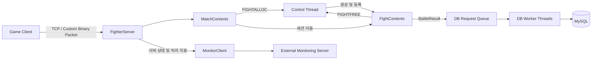
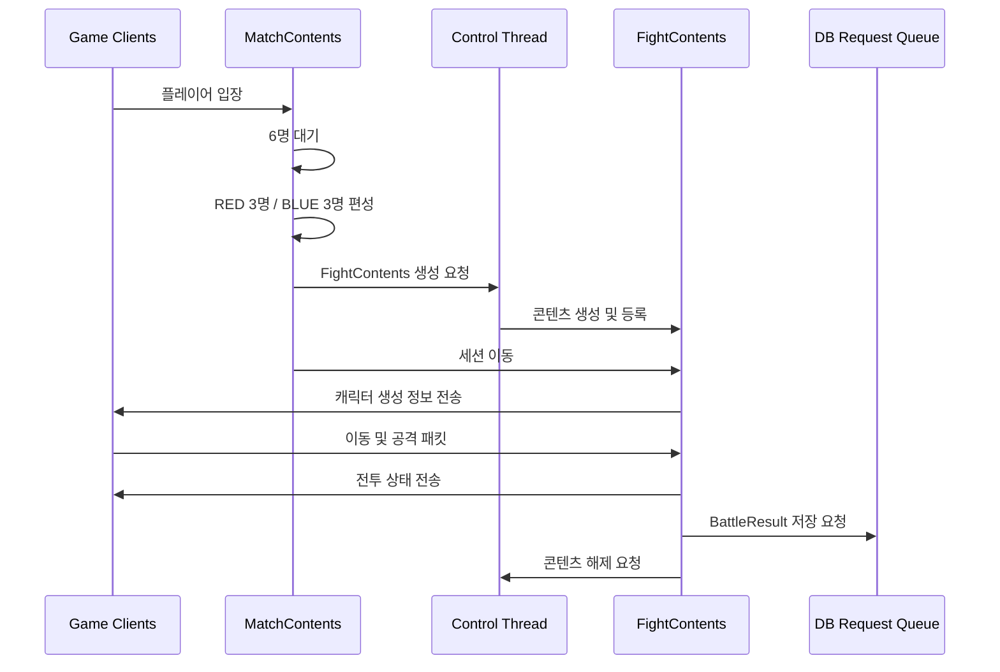
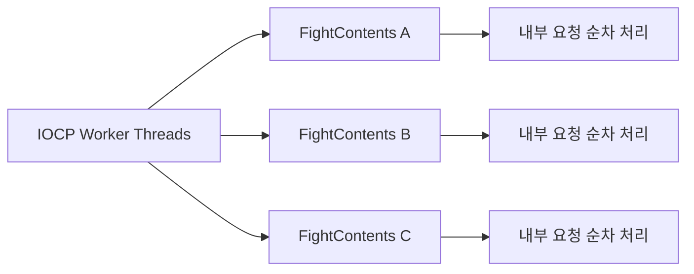
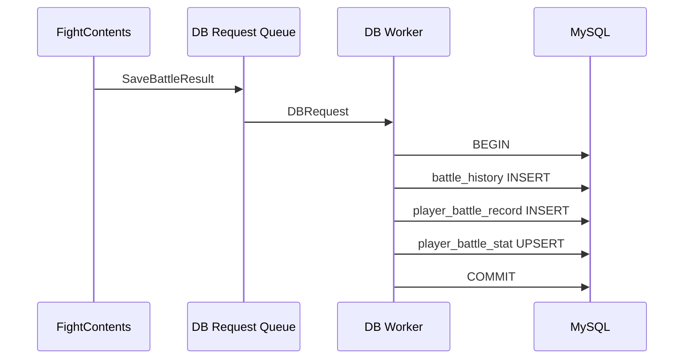
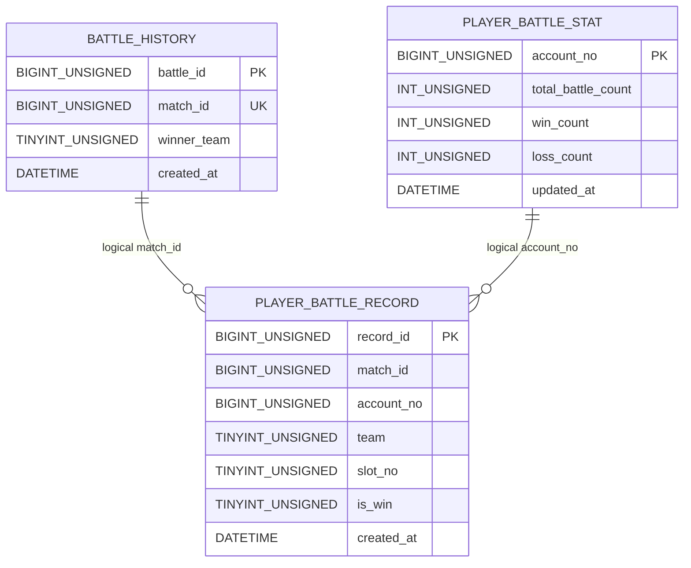

# Battle Session Server

`BattleSessionServer`는 플레이어 매칭과 3 vs 3 전투를 처리하는 Windows IOCP 기반 세션 서버입니다.

접속한 플레이어는 `MatchContents`에서 대기합니다. 6명이 모이면 Control Thread가 매치 전용 `FightContents`를 생성하고 세션을 이동시킵니다. 전투 종료 후 결과는 DB Request Queue를 통해 MySQL에 비동기로 저장됩니다.

## 서버 구성



`FighterServer`는 IOCP 기반 네트워크 처리와 콘텐츠 단위 로직의 직렬 실행을 제공하는 `ContentsServer`를 상속합니다.

| 구성 요소 | 역할 |
|---|---|
| `MatchContents` | 플레이어 대기, 6인 매칭 및 팀 편성 |
| `FightContents` | 매치별 전투 로직 처리 |
| Control Thread | 전투 콘텐츠 생성 및 해제 |
| DB Worker Thread | 전투 결과 비동기 저장 |
| MonitorClient | 외부 모니터링 서버로 지표 전송 |

## 매칭 및 전투 흐름



### 매칭

1. 접속한 세션은 기본 콘텐츠인 `MatchContents`에 배치됩니다.
2. 대기 인원이 6명이 되면 RED와 BLUE 팀에 각각 3명씩 배정합니다.
3. `FIGHTALLOC` 메시지를 Control Queue에 등록합니다.
4. Control Thread가 Fight Pool에서 `FightContents`를 할당합니다.
5. Match ID와 팀 정보를 설정하고 콘텐츠 맵에 등록합니다.
6. 매칭된 세션을 생성된 전투 콘텐츠로 이동시킵니다.

### 전투

6명의 플레이어가 모두 입장하면 팀과 슬롯에 따라 캐릭터의 초기 위치, 방향 및 HP를 설정합니다.

전투 콘텐츠는 다음 로직을 처리합니다.

- 캐릭터 생성 및 제거
- 이동 시작과 정지
- 공격 및 피격
- HP 변경
- 게임 종료 조건 확인
- 전투 결과 생성

`FightContents`는 20ms Frame을 기준으로 플레이어의 이동 상태를 갱신하며, 좌표가 전투 영역을 벗어나지 않도록 제한합니다.

## 콘텐츠 단위 로직 직렬 실행

동일한 콘텐츠에 전달된 요청은 콘텐츠 단위로 순차 처리됩니다.

이를 통해 하나의 `FightContents` 안에서 여러 Worker Thread가 동시에 플레이어 상태를 변경하지 않도록 구성했습니다. 서로 다른 `FightContents`는 여러 IOCP Worker Thread를 통해 병렬로 실행할 수 있습니다.



## 전투 요청 검증

서버는 클라이언트가 전달한 이동 및 공격 정보를 그대로 적용하지 않고 유효성을 검사합니다.

- 정의된 이동 방향인지 확인
- 서버 위치와 요청 좌표의 오차 검사
- 이동 요청 최소 간격 검사
- 공격 요청 최소 간격 검사
- 공격 종류별 타격 범위 검사

이동 요청은 최소 20ms, 공격 요청은 최소 200ms 간격으로 제한합니다.

## Control Thread와 콘텐츠 생명주기

`FightContents`의 생성과 해제는 전용 Control Thread가 담당합니다.

| Control Type | 역할 |
|---|---|
| `FIGHTALLOC` | 새로운 `FightContents` 생성 및 등록 |
| `FIGHTFREE` | 종료된 `FightContents` 등록 해제 |
| `MATCHDEREGISTER` | 서버 종료 과정에서 `MatchContents` 등록 해제 |

### 생성

Control Thread는 Fight Pool에서 객체를 할당하고 이전 사용 상태를 초기화합니다. 이후 Contents Number, Match ID와 팀 정보를 설정하고 콘텐츠 맵에 등록합니다.

### 해제

게임이 종료되면 `FightContents`가 `FIGHTFREE` 요청을 Control Queue에 등록합니다.

Control Thread가 해당 콘텐츠를 콘텐츠 맵에서 제거합니다. 마지막 `shared_ptr` 참조가 해제되면 Custom Deleter를 통해 `FightContents`가 Fight Pool로 반환됩니다.

콘텐츠 실행 로직과 콘텐츠 맵 변경을 분리하여 콘텐츠의 생명주기를 관리합니다.

## shared_ptr 기반 콘텐츠 수명 관리

Frame Scheduler와 IOCP Worker Thread는 콘텐츠 맵에서 `shared_ptr<Contents>`를 복사한 뒤 Map Shared Lock을 해제합니다.

```text
Map Shared Lock 획득
→ 콘텐츠 조회 및 shared_ptr 복사
→ Map Shared Lock 해제
→ 콘텐츠별 Lock 획득
→ 콘텐츠 로직 실행
```

콘텐츠 맵의 Lock은 조회와 `shared_ptr` 복사에 필요한 구간에서만 점유합니다. 이후 콘텐츠별 Lock을 획득하여 `OnEnter()`, `OnLeave()`, `OnUpdate()` 등의 로직을 실행합니다.

Control Thread가 실행 도중 콘텐츠를 맵에서 제거하더라도 Worker Thread가 보유한 `shared_ptr`가 객체의 수명을 유지합니다.

마지막 참조가 해제되면 Custom Deleter가 실행되어 `FightContents`를 Object Pool로 반환합니다. 이를 통해 콘텐츠 맵의 Lock 점유 범위와 콘텐츠 객체의 수명 관리를 분리했습니다.

### 콘텐츠 맵 Lock 프로파일링

Raw Pointer와 `shared_ptr` 적용 버전을 동일한 조건에서 약 24시간 실행하여 콘텐츠 맵 Lock의 대기 및 점유 시간을 비교했습니다.

- [Raw Pointer 적용 결과](docs/profiling/content-lock-before.txt)
- [shared_ptr 적용 결과](docs/profiling/content-lock-after.txt)
- [관련 PR #24](https://github.com/wOwOv/MO_Session_Server/pull/24)

## Match ID 생성

각 전투에는 `MatchIDGenerator`가 생성한 64비트 Match ID를 부여합니다.

```text
| Timestamp 42bit | Server ID 10bit | Sequence 12bit |
```

- Timestamp: 2026-01-01 UTC 기준 밀리초
- Server ID: 서버 식별자
- Sequence: 동일 밀리초에 생성된 순번

동일 밀리초에 Sequence를 모두 사용하면 다음 밀리초까지 대기합니다. 시스템 시간이 이전 값보다 뒤로 이동한 경우에는 마지막 Timestamp를 유지하여 ID가 역행하지 않도록 처리합니다.

Match ID는 `MatchIDGenerator`를 소유한 Control Thread에서 생성합니다.

## 비동기 DB 저장

전투 종료 후 `FightContents`는 Match ID, 승리 팀과 참가자 정보가 포함된 `BattleResult`를 DB Request Queue에 등록합니다.

DB Worker Thread가 Queue에서 요청을 가져와 다음 데이터를 저장합니다.

| 테이블 | 저장 내용 | 처리 방식 |
|---|---|---|
| `battle_history` | Match ID와 승리 팀 | INSERT |
| `player_battle_record` | 참가자 6명의 팀, 슬롯 및 승패 | Multi-row INSERT |
| `player_battle_stat` | 플레이어별 누적 전투·승리·패배 | UPSERT |



세 테이블의 변경은 하나의 Transaction으로 처리합니다. 중간 단계에서 오류가 발생하면 Rollback을 수행합니다.

### 재시도 정책

Deadlock 또는 Lock Timeout은 다음 조건을 만족하는 경우에만 재시도합니다.

- Commit 단계에서 발생한 오류가 아님
- Commit 결과가 불확실하지 않음
- Rollback이 필요한 경우 Rollback에 성공함

최대 저장 시도 횟수는 3회입니다. 재시도 전에는 시도 횟수에 따라 5ms, 10ms만큼 대기합니다.

Commit 결과를 확인할 수 없거나 Rollback에 실패한 경우에는 중복 저장 가능성을 고려하여 자동 재시도하지 않습니다.

DB Worker Thread의 개수는 설정을 통해 1~4개로 지정할 수 있습니다.

### DB 저장 성능 측정

DB Worker 수에 따른 저장 성능과 InnoDB Buffer Pool·Redo Log 설정에 따른 처리 시간을 비교했습니다.

#### DB Worker 수 비교

- [DB Worker 1개](docs/profiling/db-worker-1.txt)
- [DB Worker 2개](docs/profiling/db-worker-2.txt)
- [관련 PR #32](https://github.com/wOwOv/MO_Session_Server/pull/32)

#### InnoDB 설정 비교

- [Buffer Pool 512MB / Redo Log 100MB](docs/profiling/db-buffer-512-redo-100.txt)
- [Buffer Pool 128MB / Redo Log 512MB](docs/profiling/db-buffer-128-redo-512.txt)
- [Buffer Pool 512MB / Redo Log 512MB](docs/profiling/db-buffer-512-redo-512.txt)
- [관련 Issue #35](https://github.com/wOwOv/MO_Session_Server/issues/35)

## DB 구조 및 저장 결과

전투 결과는 세 테이블에 저장됩니다.



테이블은 `match_id`와 `account_no`를 기준으로 논리적으로 연결됩니다.

### Key 및 Index

#### `battle_history`

- Primary Key: `battle_id`
- Unique Key: `match_id`

#### `player_battle_record`

- Primary Key: `record_id`
- 복합 Unique Key: `(match_id, account_no)`
  - 동일한 매치에 같은 플레이어 기록이 중복 저장되는 것을 방지합니다.
- Index: `match_id`
- 복합 Index: `(account_no, created_at)`

#### `player_battle_stat`

- Primary Key: `account_no`

### 전투 결과 저장 예시

하나의 Match ID에 대해 다음 데이터가 하나의 Transaction으로 저장된 결과입니다.

- `battle_history`의 매치 결과 1행
- `player_battle_record`의 참가자 기록 6행
- `player_battle_stat`의 누적 전투 통계


## 모니터링

`FighterServer::OnSecond()`가 서버 상태와 처리 지표를 수집하고 `MonitorClient`를 통해 외부 모니터링 서버로 전송합니다.

- CPU 및 메모리 사용량
- 현재 세션과 매칭 대기 인원
- 초당 Accept 및 패킷 송수신 수
- 초당 `FightContents` 생성 및 해제 수
- Control Queue와 DB Queue 크기
- 사용 중인 Packet Buffer와 `FightContents` 수
- Fight FPS 평균·최솟값·최댓값
- 초당 DB 저장 처리 건수
- DB 저장 성공, 실패, 재시도 및 오류 유형

> 모니터링 서버는 별도 프로젝트로 구성되어 있으며 이 저장소에는 포함되어 있지 않습니다.

## 서버 종료 과정

서버는 구성 요소 사이의 의존성을 고려하여 다음 순서로 종료합니다.

1. 신규 연결 Accept 중지
2. `MatchContents` 종료 및 등록 해제
3. Control Thread 종료
4. Frame Scheduler Thread 종료
5. IOCP Worker Thread 종료
6. DB Request Queue에 남은 요청 처리
7. DB Worker Thread 종료
8. Monitor Thread와 MonitorClient 종료

DB Worker는 종료 전에 Queue에 남아 있는 저장 요청을 처리합니다.

## 설정 및 실행

전체 시스템 실행에는 MySQL Server, 외부 모니터링 서버와 호환되는 게임 클라이언트가 필요합니다.

| 파일 | 역할 |
|---|---|
| `FighterServerConfig.cnf` | IP, Port, IOCP Worker 및 DB Worker 설정 |
| `DBInfo.txt` | MySQL 접속 정보 |
| `MonitorClient_Config.txt` | 외부 모니터링 서버 접속 정보 |
| `MessageProtocol.txt` | 전투 메시지 정의 |

실행 순서는 다음과 같습니다.

1. MySQL Server 실행
2. 외부 모니터링 서버 실행
3. 서버, DB 및 모니터링 접속 정보 설정
4. `BattleSessionServer` 빌드 및 실행
5. 게임 클라이언트 접속

### 서버 종료 방법

서버를 정상적으로 종료하려면 다음 순서로 키를 입력합니다.

1. `U`: Control Mode 활성화
2. `Q`: 서버 종료 절차 실행
3. `B`: 종료 절차 완료 후 Main Loop 종료

`Q`를 입력하면 Accept Thread, 콘텐츠, Control Thread, Frame Scheduler, IOCP Worker Thread, DB Worker Thread와 Monitor Thread를 순서대로 정리합니다.

모든 서버 구성 요소의 정리가 완료된 후 `B`를 입력하면 `main()`의 반복문을 빠져나가 프로세스가 종료됩니다.

## 관련 문서

- [MO Session Server](../../README.md)
- [ContentLibB](../../Libraries/ContentLibB/README.md)
- [Common](../../Common/README.md)
- [Lock-Free Containers](../../Common/LockFree/README.md)
- [TLS Utilities](../../Common/TLS/README.md)
